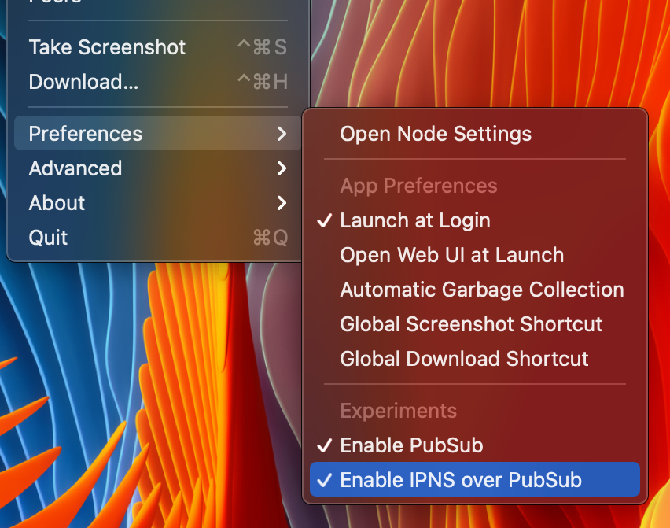

# IPFS

This doc describes various topics regarding our use of IPFS (currently only used for Sourcify integration).

## Default public gateway by default

By default every IPFS resource is linked to the default public IPFS gateway at https://ipfs.io.

This is done so even users without a local node can use IPFS integration by default.

However this brings us some privacy concerns, since queries are made against the public gateway.

We recommend the use of [IPFS Companion](https://docs.ipfs.io/install/ipfs-companion/), a popular browser extension that intercepts gateway calls and redirect them to your local gateway.

This also solves the problem of users not having a local gateway at http://localhost:8080 (the default bind address of `ipfs` daemon, but also a very common bind address for other software leading to collisions), but instead having a private gateway inside the local network. The IPFS Companion allows you to customize which gateway you want it to redirect requests to.

This way we can provide an out-of-box usable integration, but still allowing users to address privacy concerns.

## Slow IPNS resolution

By default IPNS resolution _may_ be **extremely** slow. There is an experimental IPFS feature called IPNS pubsub that speeds it up significantly (https://github.com/ipfs/go-ipfs/blob/master/docs/experimental-features.md#ipns-pubsub), but for it to work, it needs to be enabled in **both** resolver and publisher nodes.

We asked Sourcify to enable it in their publisher node, so you just have to enable it in your local node to have an usable performance.

On IPFS Companion, make sure **both** `Enable PubSub` and `Enable IPNS over PubSub` options are enabled.



## Pinning Sourcify locally

If you have an IPFS node, you can speedup things significantly and also help to spread their data among the network by pinning their entire repository.

However, due to their repository characteristics (> 5 GB of thousands of small files and many nested directories), there are a few gotchas.

> Please note this is based on Otterscan author's experience, it would be welcome to have more datapoints.

### Use `badgerds`

By default ipfs uses the `flatfs` datastore, which stores objects in simple files.

I simply couldn't finish pinning the entire repo using the default settings, after 6 hours it was able to get only ~10% of the total repo, the pinning process itself slows down the computer a lot.

`badgerds` is an alternative ipfs node repository format, still labeled as experimental, but marked as a _"to be turned into the default"_ repository format in future. It uses a key-value database internally.

You can create a repository from scratch by using `ipfs init -p badgerds`, or convert an existing repository using [ipfs-ds-convert](https://github.com/ipfs/ipfs-ds-convert).

> Use it at your own risk!

My experiments pinning the entire repo on `badgerds` gave different timings, varying from 1 to 2 hours in a standard MacBook Pro laptop, totally affordable for home users, with no perceived system degradation.

```
$ time ipfs pin add --progress /ipns/repo.sourcify.dev
pinned QmVn7fcwo4Eai19hRX6dG9jAV8piHyxcrPTuobyZjEKhMW recursively
ipfs pin add --progress   4.47s user 1.85s system 0% cpu 2:22:41.00 total
```

### IPFS root changes hourly

The Sourcify root IPNS name is `/ipns/repo.sourcify.dev`.

Pinning it resolves it to the current IPFS root hash. However, any change to their contents changes the root hash (e.g., new contracts are verified).

Sourcify current runs a cron job the updates the IPNS name hourly. It means that your pin will eventually become stale.

But we think it is still worth pinning the repo because data always gets added to their repo, so by pinning current data you are speeding up your own queries to existing contracts and contributing to spread their data over the network so other people don't have to rely 100% on their node availability.
